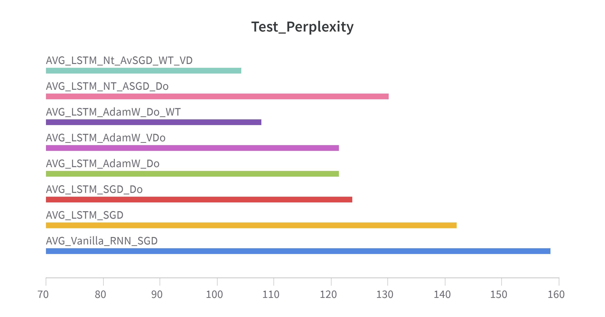
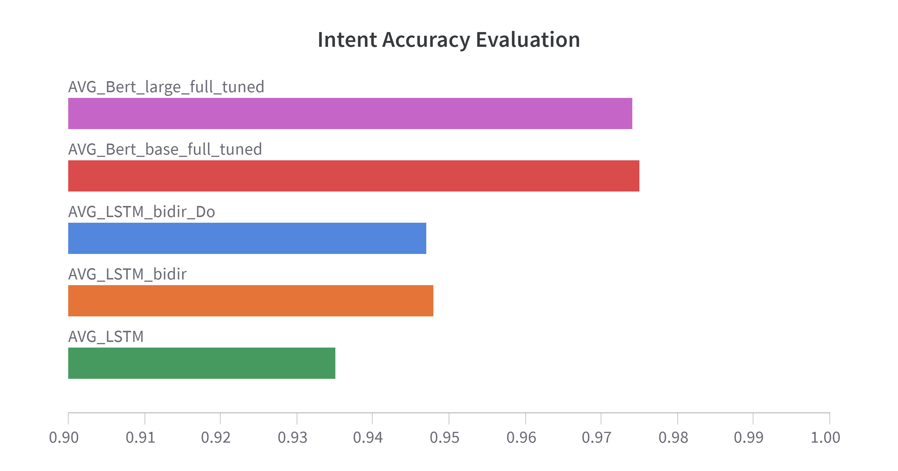
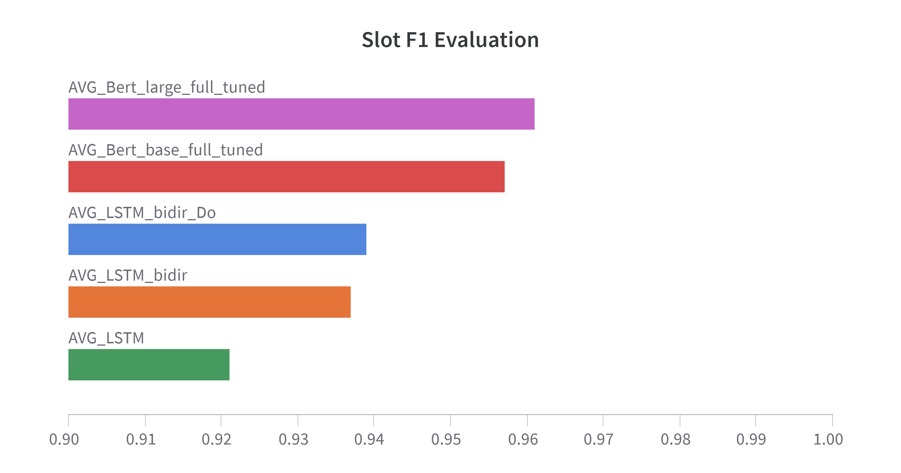

# Natural Language Understanding

## Assignment 1: *Languange models and regularization strategies*

In this assignment, we develop a *language model* (LM) to represent the probability distribution over a sequence of tokens. Starting with a *vanilla recurrent neural network* (RNN) followed by a linear and softmax layer trained using *stochastic gradient descent*, we explore various enhancements. Experiments incorporating *Long-Short Term Memory* (LSTM) networks, *dropout layers*, and the *AdamW* optimizer result in a significant reduction in test set perplexity. Applying *Weight Tying*, *Variational Dropout*, and *Non-monotonically Triggered Averaged SGD* (NT-ASGD) further reduce the perplexity to **104**, surpassing the baseline by more than **50** points.

    

_References_
1. [Regularizing and Optimizing LSTM Language Models](https://arxiv.org/abs/1708.02182), S. Merity et al., 2017

## Assignment 2: *Joint intent classification and slot filling*

In this assignment, we develop a *language model* (LM) for joint *intent classification* and *slot filling*. Initially, we implement an *LSTM*-based architecture, followed by separate classifiers for intent and slot predictions. Performance improves using a *bidirectional LSTM* and adding *dropout layers*. Integrating *BERT* as a foundation model and leveraging its contextual embeddings further improves test scores by over **2.5%** in both tasks. Finally, we evaluate the impact of fine-tuning all *BERT* layers, half of them, and only the last one, observing a performance drop in *slot filling* for reduced fine-tuning.

    
    

_References_
1. [BERT for Joint Intent Classification and Slot Filling](https://arxiv.org/abs/1902.10909), Qian Chen et al., 2019
2. [BERT base/large model](https://huggingface.co/google-bert/bert-base-uncased)

## Assignment 3: Polarity Classification

_References_
1. [Open-Domain Targeted Sentiment Analysis via Span-Based Extraction and Classification](https://arxiv.org/abs/1906.03820), Minghao Hu et al., 2019

## Course Syllabus
- Basic concepts (corpus, lexicon, token, Ngrams, frequency list, stop words)
- Experimental Methodology in Natural Language Processing (Bag of words for document classification)
- Statistical Language Models (Ngram Language Models)
- Language Models with Neural Networks (RNN, LSTM, GRU)
- Transformer-based Language Models and Tokenizers based on byte pair encoding (*BERT*)
- Evaluation Metrics: (Macro, Micro, Weighted) Accuracy, Recall, Precision, F1-Score, Perplexity
- Lexicon/Aspect-based Sentyment Analysis: polarity  classification, subjectivity identification
- Part of Speech Tagging and Sequence Labeling
- Named Entity Recognition and Shallow Parsing
- Constituency Grammars
- Dependency Parsing
- Word Sense Disambiguation

_References_
1. [Speech and Language Processing](https://web.stanford.edu/~jurafsky/slp3/)
2. [Dive into Deep Learning](https://d2l.ai/index.html)
3. [Natural Language Processing with Python](https://www.nltk.org/book/)
